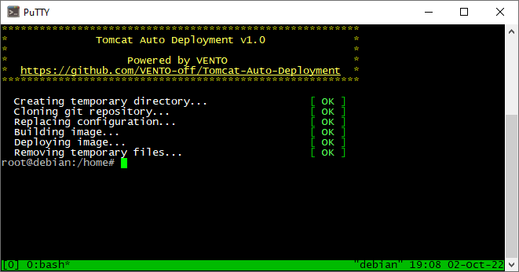

# Tomcat Auto Deployment v1.0
A simple script for Linux that can help you easily deploy projects from git to Tomcat server.



## Script workflow
1. Downloads project from git
2. Replaces the necessary configuration files before compiling
3. Builds image with **Maven** or **Gradle**
4. Deploys image to Tomcat

## Installation
1. Generate a new **SSH key** on your Linux server (more info [here](https://docs.github.com/en/authentication/connecting-to-github-with-ssh/generating-a-new-ssh-key-and-adding-it-to-the-ssh-agent#generating-a-new-ssh-key))
    ```
    ssh-keygen -t ed25519
    ```
2. Install **git** package
    ```
    apt-get install git
    ```
3. Install **Maven** or **Gradle**
    ```
    apt-get install maven
    ```
4. Download `deploy.sh` to your Linux server
5. Locate `deploy.sh` and open with text editor to configure the script

## Settings
You need to configure some variables that are located at the beginning of `deploy.sh`
```
#
# Settings
#
...
```

| Variable name       | Description                                                         | Example value                                   |
|---------------------|---------------------------------------------------------------------|-------------------------------------------------|
| GIT_URL             | SSH URL to clone git repository                                     | `git@github.com:user/example.git`               |
| GIT_BRANCH          | Branch to deploy                                                    | `master`                                        |
| JDK_HOME            | Installed JDK path (for Maven)                                      | `/usr/lib/jvm/jdk1.8.0`                         |
| BUILD_SCRIPT        | Script to build image                                               | `mvn compile package`<br/>or<br/>`gradle build` |
| ORIGINAL_CONFIG_DIR | Configuration files that will be replaced in the cloned git project | `/opt/configs/project/*`<br/>or<br/>`""`        |
| REPLACE_CONFIG_DIR  | Destination of configuration files in git project                   | `/src/main/resources/`<br/>or<br/>`""`          |
| IMAGE_PATH          | Compiled image path                                                 | `/target/ROOT.war`                              |
| DEPLOY_PATH         | Image path to be replaced in Tomcat directory                       | `/opt/tomcat/webapps/ROOT.war`                  |

> Note: if you don't need the _replace configuration_ feature just leave these variables empty (`""`): `ORIGINAL_CONFIG_DIR` and `REPLACE_CONFIG_DIR`.

## Usage
Run the following command in the terminal:
```
./deploy.sh
```

> Note: you may need to run `chmod +x deploy.sh` after first script installation.

## Logs
All the logs are stored in the `deploy.log` file.
